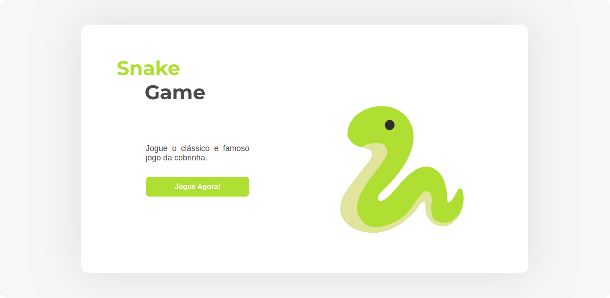

<h1 align="center">
    
</h1>

<br/>

> O projeto é a recriação do clássico Snake Game, realizado durante o Bootcamp de Desenvolvimento FrontEnd da Digital Innovation One.

---

<br/>

# :pushpin: Índice

- [Tecnologia](#rocket-tecnologia)
- [Como usar](#information_source-como-usar)
- [Layout](#iphone-layout)

<br/>

# :rocket: Tecnologia

Esse projeto utiliza as seguintes tecnologias:

- HTML
- CSS
- JavaScript

<br/>

# :information_source: Como usar

```bash
# Clone este repositório:
$ git clone https://github.com/JonataRamalho/snake-game.git

# Vá para o repositório:
$ cd snake-game

# Vá para o arquivo index.html
$ cd src/views/

# Insira esse comando para executar o index.html
$ firefox index.html &
```

<br/>

# :iphone: Layout
<p align="center">
    &nbsp;&nbsp;&nbsp;
    <br/>
    <br/>
    
</p>

Feito por [Jonata Ramalho](https://github.com/JonataRamalho) :wink: